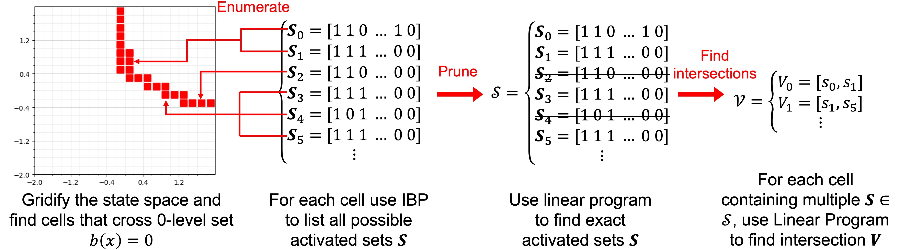

<a name="readme-top"></a>
<div align="center">
  <!-- <a href="https://github.com/HongchaoZhang-HZ/exactverif-reluncbf-nips23">
    
  </a> -->

  <h2 align="center">Exact Verification of ReLU NCBFs</h2>

  <p align="center">
    Exact Verification of ReLU Neural Control Barrier Functions (NeurIPS 2023)
    <br />
    <!-- <a href="https://github.com/HongchaoZhang-HZ/exactverif-reluncbf-nips23"><strong>NeurIPS2023 version »</strong></a> -->
    <a href="https://github.com/HongchaoZhang-HZ/exactverif-reluncbf-nips23/zhang2023exact.pdf"><strong>Full Paper »</strong></a>
    <br />
  </p>
</div>
<p align="center">
  
  
</p>

<!-- TABLE OF CONTENTS -->
<!-- <details> -->
  <summary>Table of Contents</summary>
  <ol>
    <li>
      <a href="#exact-verification-algorithm">Exact Verification Algorithm</a>
    </li>
    <li><a href="#experiments">Experiments</a></li>
    <li>
      <a href="#getting-started">Getting Started</a>
      <ul>
        <li><a href="#installation">Installation</a></li>
        <li><a href="#run-the-code">Run the Code</a></li>
      </ul>
    </li>
    <li><a href="#citation"> Citation</a></li>
    <!-- <li><a href="#usage">Usage</a></li>
    <li><a href="#roadmap">Roadmap</a></li>
    <li><a href="#contributing">Contributing</a></li> -->
    <li><a href="#license">License</a></li>
    <li><a href="#contact">Contact</a></li>
    <li><a href="#acknowledgments">Acknowledgments</a></li>
  </ol>
<!-- </details> -->


<!-- EXACT VERIFICATION ALGORITHM -->
## Exact Verification Algorithm

<p align="center">
    <a href="https://github.com/HongchaoZhang-HZ/exactverif-reluncbf-nips23">
    
  </a>
  <br />
</p>

The preceding proposition motivates our overall approach to verifying a NCBF $b(x)$, consisting of the following steps. 
1. We conduct coarser-to-finer search by discretizing the state space into hyper-cubes and use linear relaxation based perturbation analysis (LiRPA) to identify grid squares that intersect the boundary $\{x: b(x) = 0\}$. 
2. We enumerate all possible activation sets within each hyper-cube using Interval Bound Propagation (IBP). We then identify the activation sets and intersections that satisfy $b(x)=0$ using linear programming. 
3. For each activation set and intersection of activation sets, we verify the conditions of Proposition \ref{prop:safety-condition}. In what follows, we describe each step in detail.

The above figure illustrates the proposed coarser-to-finer searching method. Hyper-cubes that intersect the safety boundaries are marked in red. When all possible activation sets are listed, we can  identify exact activation set and intersections. 


<p align="right">(<a href="#readme-top">back to top</a>)</p>


<!-- EXPERIMENTS -->
## Experiments

**Darboux:** We consider the Darboux system proposed by [[1]](zeng2016darboux), a nonlinear open-loop polynomial system that has been widely used as a benchmark for constructing barrier certificates. The dynamic model is given in the supplement. We obtain the trained NCBF by following the method proposed in [[2]](zhao2020synthesizing). 

**Obstacle Avoidance:** We evaluate our proposed method on a controlled system [[3]](barry2). We consider an Unmanned Aerial Vehicles (UAVs) avoiding collision with a tree trunk. We model the system as a  Dubins-style [[4]](dubins1957curves) aircraft model. The system state  consists of 2-D position and aircraft yaw rate $x:=[x_1, x_2, \psi]^T$. We let $u$ denote the control input to manipulate yaw rate and the dynamics defined in the supplement. 
We train the NCBF via the method proposed in [[2]](zhao2020synthesizing) with $v$ assumed to be $1$ and the control law $u$ designed as
 $u=\mu_{nom}(x)=-\sin \psi+3 \cdot \frac{x_1 \cdot \sin \psi+x_2 \cdot \cos \psi}{0.5+x_1^2+x_2^2}$. 

**Spacecraft Rendezvous:** We evaluate our approach on a spacecraft rendezvous problem from [[5]](jewison2016spacecraft). A station-keeping controller is required to keep the "chaser" satellite within a certain relative distance to the "target" satellite. The state of the chaser is expressed relative to the target using linearized Clohessy–Wiltshire–Hill equations, with state $x=[p_x, p_y, p_z, v_x, v_y, v_z]^T$, control input $u=[u_x, u_y, u_z]^T$ and dynamics defined in the supplement. We train the NCBF as in [[6]](dawson2023safe). 

**hi-ord $_8$:** We evaluate our approach on an eight-dimensional system that first appeared in [[7]](abate2021fossil) to evaluate the scalability of proposed verification method. 

<p align="right">(<a href="#readme-top">back to top</a>)</p>

<!-- GETTING STARTED -->
## Getting Started

This is an example of how you may give instructions on setting up your project locally.
To get a local copy up and running follow these simple example steps.

### Installation

Clone the repo and navigate to the folder
```sh
git clone https://github.com/HongchaoZhang-HZ/exactverif-reluncbf-nips23.git

cd exactverif-reluncbf-nips23
```

Install packages via pip
   ```sh
   pip install -r requirements.txt
   ```

### Run the code

Choose the system and corresponding NCBFs you want to verify and navigate to the folder, e.g., '/Darboux/darboux_2_64/' and run the code
   ```sh
   python main.py
   ```

<p align="right">(<a href="#readme-top">back to top</a>)</p>

<!-- CITATION -->
## Citation
If our work is useful for your research, please consider citing:

<!-- insert bibtex format code block -->
```
@inproceedings{zhang2023exact,
  title={Exact Verification of Re{LU} Neural Control Barrier Functions},
  author={Zhang, Hongchao and Junlin, Wu and Yevgeniy, Vorobeychik and Clark, Andrew},
  booktitle={Advances in neural information processing systems},
  year={2023}
}
```

<p align="right">(<a href="#readme-top">back to top</a>)</p>

<!-- LICENSE -->
## License

Distributed under the MIT License. See `LICENSE.txt` for more information.

<p align="right">(<a href="#readme-top">back to top</a>)</p>


<!-- CONTACT -->
## Contact

If you have any questions, please feel free to reach out to us.

Hongchao Zhang - [Homepage](https://hongchaozhang-hz.github.io/) - hongchao@wustl.edu

Project Link: [https://github.com/HongchaoZhang-HZ/exactverif-reluncbf-nips23](https://github.com/HongchaoZhang-HZ/exactverif-reluncbf-nips23)

<p align="right">(<a href="#readme-top">back to top</a>)</p>


<!-- ACKNOWLEDGMENTS -->
## Acknowledgments
This research was partially supported by the NSF (grants CNS-1941670, ECCS-2020289, IIS-1905558, and IIS-2214141), AFOSR (grant FA9550-22-1-0054), and ARO (grant W911NF-19-1-0241).

<p align="right">(<a href="#readme-top">back to top</a>)</p>

[zeng2016darboux]: https://dl.acm.org/doi/abs/10.1145/2968478.2968491
[barry2012safety]: https://ieeexplore.ieee.org/abstract/document/6224645
[dubiins1957curves]: https://www.jstor.org/stable/2372537?seq=1
[jewison2016spacecraft]: https://ieeexplore.ieee.org/abstract/document/7798763
[dawson2023safe]: https://ieeexplore.ieee.org/abstract/document/9531393
[abate2021fossil]: https://link.springer.com/chapter/10.1007/978-3-030-81608-0_4
[zhao2020synthesizing]: https://dl.acm.org/doi/abs/10.1145/3365365.3382222
